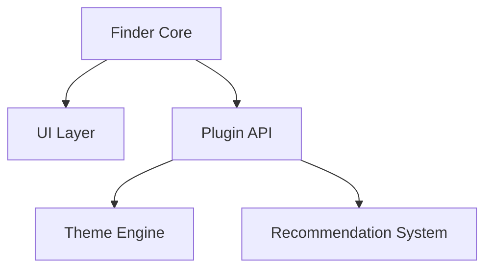

# 🌌 VRChat Group Finder (VRC_GF)


> 🛰️ Discover, track, and share VRChat worlds effortlessly.

---

**Languages:** [🇯🇵 Japanese](README.md) | 🇬🇧 English

---

## 🪐 Overview

**VRC_GF** is a powerful tool designed to make exploring VRChat worlds easier and more enjoyable.
With features like tag-based recommendations, calendar scheduling, and custom themes,
it helps you discover your *next favorite world* in VRChat.

---

## ✨ Features

| Category                      | Description                                                   |
| ----------------------------- | ------------------------------------------------------------- |
| 🧭 **World Discovery**        | Recommended worlds by tag or category with a custom algorithm |
| 🗓️ **Schedule Management**   | Visualize events and visit plans in calendar view             |
| 📊 **Statistics Dashboard**   | Automatically track playtime and visit trends                 |
| ❤️ **Favorites**              | Bookmark and organize frequently visited worlds               |
| 🎨 **Themes & Customization** | Plugin, extension, and theme support for a personalized UI    |
| 🌐 **World Link Integration** | Open or share VRChat world URLs directly                      |
| 🕒 **Timezone Support**       | View your friends' schedules in local time                    |

---

## 🧩 Extensibility

* **🔌 Plugin API**: Easily extend functionality with third-party plugins
* **🎨 Theme Engine**: Customize appearance using CSS-like themes
* **🌍 Finder Hub**: Share and discover popular plugins & themes *(coming soon)*

---

## 📸 Screenshots

> UI previews coming soon.
> 
> 

---

## 🗺️ Roadmap

* [ ] Mobile-friendly UI
* [ ] VR in-browser support
* [ ] Friend sharing feature
* [ ] Finder Cloud Sync (local + optional cloud backup)

---

## 🧠 Architecture



---

## 🤝 Contributing

Contributions are always welcome!
If you're interested in **plugin development** or **improving the recommendation algorithm**, we’d love your help.

```bash
# Clone the repository
git clone https://github.com/aiueodayon/VRC_GF.git

# Install dependencies
npm install

# Start development
npm run dev
```

---

## 📜 License

Licensed under the [MIT License](./LICENSE) © 2025 [Astral](https://github.com/aiueodayon)

---

## 💫 Links

* 🌐 **Website:** [finder.astraldao.shop](https://finder.astraldao.shop)
* 👤 **Author:** [Astral (aiueodayon)](https://github.com/aiueodayon)

---

<div align="center">
  <br><br>
  <strong>VRChat_GroupFinder</strong> — *“Find your next favorite world — faster, smarter, and together.”*  
  <br><br>
  <sub>© 2025 Astral | Designed for the VRChat Community</sub>
</div>
